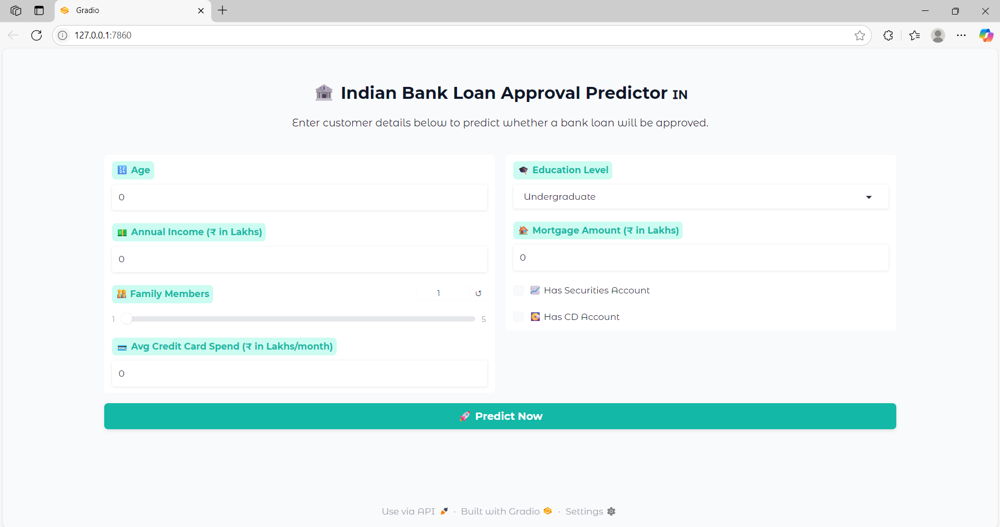

# 🏦 Indian Bank Loan Approval Predictor 🇮🇳
An end-to-end machine learning project that predicts whether a customer is eligible for a bank loan based on key financial and demographic inputs.

> 🚀 Built with **Python**, **Scikit-learn**, and a **Gradio Web Interface**, this project is deployable and ready for real-world demo.

---

## 📌 Key Features

- ✅ End-to-end ML pipeline (data cleaning, model training, evaluation)
- ✅ Deployed Gradio web app with real-time prediction
- ✅ Clean and colorful UI for user-friendly interaction
- ✅ Based on Indian financial metrics (INR)

---

## 📊 Problem Statement

In the financial sector, automating loan approvals reduces workload and decision time. This model helps predict whether a customer will be approved for a loan using inputs like:

- Age
- Annual Income (₹ in Lakhs)
- Credit Card Spend
- Education Level
- Mortgage
- Family Size
- Account Ownership (Securities, CD)

---

## 🧠 Tech Stack

| Domain            | Tools Used                            |
|-------------------|----------------------------------------|
| Language          | Python 3.12.6                             |
| Libraries         | Pandas, NumPy, Scikit-learn, Joblib    |
| ML Algorithm      | RandomForestClassifier (500 estimators)|
| UI Framework      | Gradio                                 |
| Deployment Ready? | ✅ Yes                                  |

---

## 🚀 How to Use

1. **Clone the Repository**
```bash
git clone https://github.com/karthik-lakkimsetti/BankLoanPrediction.git
cd BankLoanPrediction
```

2. **Create and Activate Virtual Environment**
```bash
python -m venv venv
venv\Scripts\activate   # On Windows
```

3. **Install Required Libraries**
```bash
pip install -r requirements.txt
```

4. **Run the App**
```bash
python app.py
```

---

## 🌍 Sample UI Preview




---

## 🔍 Sample Inputs

| Feature              | Example        |
|----------------------|----------------|
| Age                  | 30             |
| Income (₹ in Lakhs)  | 6.5            |
| Family Members       | 3              |
| CCAvg (₹ in Lakhs/mo)| 0.2            |
| Education            | Graduate       |
| Mortgage (₹ in Lakhs)| 5              |
| Securities Account   | ✅ Yes          |
| CD Account           | ❌ No           |

---

## 📦 Files in This Repo

| File Name                      | Description                          |
|--------------------------------|--------------------------------------|
| `bankloan.csv`                | Dataset used for training            |
| `loan_model.pkl`              | Trained Random Forest model          |
| `app.py`                      | Main app with Gradio UI              |
| `app.ipynb`                   | Jupyter notebook (training + analysis)|
| `requirements.txt`            | All required Python packages         |
| `README.md`                   | Project summary                      |

---

## ✅ Skills Showcased

- Machine Learning & Feature Engineering
- Model Saving & Deployment (`joblib`, `gradio`)
- Python project structure and best practices
- Real-time prediction UI with input validation
- Working with tabular data (CSV)
- Communication & presentation for recruiters

---

## 🚀 Live Demo

👉 Try the app here: [Bank Loan Prediction](https://huggingface.co/spaces/karthik-lakkimsetti/bank-loan-predictor)

This ML app is deployed using **Gradio** on **Hugging Face Spaces**. It predicts whether a customer is eligible for a bank loan based on input details such as income, age, education, etc.


---

## 🤝 Let's Connect

📧 Email: karthiksrivardhan2004@gmail.com  
🔗 LinkedIn: [linkedin.com/in/Karthik Sri Vardhan Lakkimsetti](https://www.linkedin.com/in/karthik-sri-vardhan/)  

---

> 💼 *This project is a perfect demonstration of my ability to build full machine learning systems from data to deployment. Feel free to explore, suggest improvements, or reach out!*
